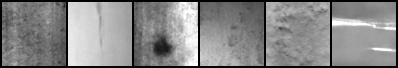
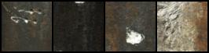
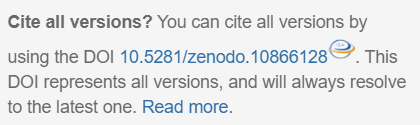

# IDDM: Integrated Design Diffusion Model

<div align="left">
    <a href="https://github.com/chairc/Integrated-Design-Diffusion-Model" target="_blank">
        
    </a>
    <a href="https://doi.org/10.5281/zenodo.10866128">
        
    </a>
    <a href="https://github.com/chairc/Integrated-Design-Diffusion-Model/blob/main/LICENSE" target="_blank">
        
    </a>
    <a href="https://github.com/chairc/Integrated-Design-Diffusion-Model/issues">
        
    </a>
    <a href="https://github.com/chairc/Integrated-Design-Diffusion-Model/releases" target="_blank">
        
    </a>
    <a href="#" target="_blank">
        
    </a>
</div>

<div align="left">
    <a href="https://github.com/chairc/Integrated-Design-Diffusion-Model/stargazers">
        
    </a>
    <a href="https://github.com/chairc/Integrated-Design-Diffusion-Model/forks" target="_blank">
        
    </a>
    <a href="https://gitee.com/chairc/Integrated-Design-Diffusion-Model">
        
    </a>
    <a href="https://gitee.com/chairc/Integrated-Design-Diffusion-Model">
        
    </a>
    <a href="https://gitcode.com/chairc/Integrated-Design-Diffusion-Model">
        
    </a>
</div>

[中文文档](README_zh.md)


### 0 About the Model

This diffusion model is based on the classic DDPM (Denoising Diffusion Probabilistic Models), DDIM (Denoising Diffusion Implicit Models) and PLMS (Pseudo Numerical Methods for Diffusion Models on Manifolds) presented in the papers "[Denoising Diffusion Probabilistic Models](https://arxiv.org/abs/2006.11239)", "[Denoising Diffusion Implicit Models](https://arxiv.org/abs/2010.02502)" and "[Pseudo Numerical Methods for Diffusion Models on Manifolds](https://openreview.net/forum?id=PlKWVd2yBkY)".

We named this project IDDM: Integrated Design Diffusion Model. It aims to reproduce the model, write trainers and generators, and improve and optimize certain algorithms and network structures. This repository is **actively maintained**.

If you have any questions, please check [**the existing issues**](https://github.com/chairc/Integrated-Design-Diffusion-Model/issues/9) first. If the issue persists, feel free to open a new one for assistance, or you can contact me via email at chenyu1998424@gmail.com or chairc1998@163.com. **If you think my project is interesting, please give me a ⭐⭐⭐Star⭐⭐⭐ :)**

#### 0.1 Repository Structure

```yaml
Integrated Design Diffusion Model
├── datasets
│   └── dataset_demo
│       ├── class_1
│       ├── class_2
│       └── class_3
├── deploy
│   ├── deploy_socket.py
│   └── deploy_server.py
├── iddm
│   ├── config
│   │   ├── choices.py
│   │   ├── model_list.py
│   │   ├── setting.py
│   │   └── version.py
│   ├── model
│   │   ├── modules
│   │   │   ├── activation.py
│   │   │   ├── attention.py
│   │   │   ├── block.py
│   │   │   ├── conv.py
│   │   │   ├── ema.py
│   │   │   └── module.py
│   │   ├── networks
│   │   │   ├── sr
│   │   │   │   └── srv1.py
│   │   │   ├── base.py
│   │   │   ├── cspdarkunet.py
│   │   │   └── unet.py
│   │   ├── samples
│   │   │   ├── base.py
│   │   │   ├── ddim.py
│   │   │   ├── ddpm.py
│   │   │   └── plms.py
│   │   └── trainers
│   │       ├── base.py
│   │       ├── dm.py
│   │       └── sr.py
│   ├── sr
│   │   ├── dataset.py
│   │   ├── demo.py
│   │   ├── interface.py
│   │   └── train.py
│   ├── tools
│   │   ├── FID_calculator.py
│   │   ├── FID_calculator_plus.py
│   │   ├── generate.py
│   │   └── train.py
│   └── utils
│       ├── check.py
│       ├── checkpoint.py
│       ├── dataset.py
│       ├── initializer.py
│       ├── logger.py
│       ├── lr_scheduler.py
│       ├── metrics.py
│       ├── processing.py
│       └── utils.py
├── results
├── test
│   ├── noising_test
│   │   ├── landscape
│   │   └── noise
│   └── test_module.py
├── webui
│   └──web.py
└── weights
```

#### 0.2 Running  Locally

Use the `git clone` or directly download the `zip` file of this repository's code, and then configure the environment locally to run it.

```bash
git clone https://github.com/chairc/Integrated-Design-Diffusion-Model.git
cd Integrated-Design-Diffusion-Model
```

#### 0.3 Installation

In addition to running locally, there are also the following two approachs for installing this code.

**Approach 1**: Use [pip](https://pypi.org/project/iddm/) install (Recommend)

```bash
pip install iddm
```

The following  packages are required.

```yaml
coloredlogs==15.0.1
gradio==5.0.0
matplotlib==3.7.1
numpy==1.25.0
Pillow==10.3.0
Requests==2.32.0
scikit-image==0.22.0
torch_summary==1.4.5
tqdm==4.66.3
pytorch_fid==0.3.0
fastapi==0.115.6
tensorboardX==2.6.1

# If you want to download gpu version
# Please use: pip install torch==1.13.0+cu116 torchvision==0.14.0+cu116 -f https://download.pytorch.org/whl/torch_stable.html
# About more torch information please click: https://pytorch.org/get-started/previous-versions/#linux-and-windows-25
# More versions please click: https://pytorch.org/get-started/previous-versions
# [Note] torch versions must >= 1.9.0
torch>=1.9.0 # More info: https://pytorch.org/get-started/locally/ (recommended)
torchvision>=0.10.0 # More info: https://pytorch.org/get-started/locally/ (recommended)
```

**Approach 2**：Repository Installation

```bash
git clone https://github.com/chairc/Integrated-Design-Diffusion-Model.git
cd Integrated-Design-Diffusion-Model
python setup.py install
```


### 1 Next Steps

- [x] [2023-07-15] Adding implement multi-GPU distributed training.
- [x] [2023-07-31] Adding implement cosine learning rate optimization.
- [x] [2023-08-03] Adding DDIM Sampling Method.
- [x] [2023-08-28] Adding fast deployment and API on cloud servers.
- [x] [2023-09-16] Support other image generation.
- [x] [2023-11-09] Adding a more advanced U-Net network model.
- [x] [2023-11-09] Support generate larger-sized images.
- [x] [2023-12-06] Reconstruct the overall structure of the model.
- [x] [2024-01-23] Adding visual webui training interface.
- [x] [2024-02-18] Support low-resolution generated images for super-resolution enhancement.[~~Super resolution model, the effect is uncertain~~]
- [x] [2024-03-12] Adding PLMS Sampling Method.
- [x] [2024-05-06] Adding FID calculator to verify image quality.
- [x] [2024-06-11] Adding visual webui generate interface.
- [x] [2024-07-07] Support custom images length and width input.
- [x] [2024-11-13] Adding the deployment of image-generating Sockets and Web server.
- [x] [2024-11-26] Adding PSNR and SSIM calculators to verify super resolution image quality.
- [x] [2024-12-10] Adding pretrain model download.
- [x] [2024-12-25] Reconstruct the overall structure of the trainer.
- [x] [2025-03-08] Support PyPI install.
- [ ] [Maybe 2025-01-31] Adding the deployment of Docker and image.
- [ ] [To be determined] Reconstruct the project by Baidu PaddlePaddle.
- [ ] [To be determined] ~~Use Latent Diffusion and reduce GPU memory usage~~


### 2 Training

**Note before training**

The training GPU implements environment for this README is as follows: models are trained and tested with the NVIDIA RTX 3060 GPU with 6GB memory, NVIDIA RTX 2080Ti GPU with 11GB memory and NVIDIA RTX 6000 (×2) GPU with 22GB (total 44GB, distributed training) memory. **The above GPUs can all be trained normally**.

#### 2.1 Start Your First Training (Using cifar10 as an Example, Single GPU Mode)

1. **Import the Dataset**

   First, upload the dataset to the target folder `datasets` [**[issue]**](https://github.com/chairc/Integrated-Design-Diffusion-Model/issues/9#issuecomment-1882902085). After uploading, the folder structure (for example, under the `cifar10` folder, there are folders for each class; `class0` folder contains all images for class 0) should look like the following:

   ```yaml
    datasets
    └── cifar10
        ├── class0
        ├── class1
        ├── class2
        ├── class3
        ├── class4
        ├── class5
        ├── class6
        ├── class7
        ├── class8
        └── class9
   ```

   At this point, your pre-training setup is complete.

2. **Set Training Parameters**

   Open the `train.py` file and modify the `parser` parameters inside the `if __name__ == "__main__":` block.

   Set the `--conditional` parameter to `True` because it's a multi-class training, so this needs to be enabled. For single-class, you can either not enable it or enable it.

   Set the `--run_name` parameter to the desired file name you want to create, for example, `cifar_exp1`.

   Set the `--dataset_path` parameter to the file path on your local or remote server, such as `/your/local/or/remote/server/file/path/datasets/cifar10`.

   Set the `--result_path` parameter to the file path on your local or remote server where you want to save the results.

   Set the `--num_classes` parameter to `10` (this is the total number of your classes. **No need to set for models after version 1.1.4**).

   Set any other custom parameters as needed. If the error `CUDA out of memory` is shown in your terminal, turn down `--batch_size` and `num_workers`.

   In the custom parameters, you can set different `--sample` such as `ddpm` or `ddim` , and set different training networks `--network` such as `unet` or `cspdarkunet`. Of course, activation function `--act`, optimizer `--optim`, automatic mixed precision training `--amp`, learning rate method `--lr_func` and other parameters can also be customized.

   For detailed commands, refer to the **Training Parameters** section.

3. **Wait for the Training Process**

   After clicking `run`, the project will create a `cifar_exp1` folder in the `results` folder. This folder will contain training log files, model training files, model EMA (Exponential Moving Average) files, model optimizer files, all files saved during the last training iteration, and generated images after evaluation.

4. **View the Results**

   You can find the training results in the `results/cifar_exp1` folder.


**↓↓↓↓↓↓↓↓↓↓The following is an explanation of various training methods and detailed training parameters↓↓↓↓↓↓↓↓↓↓**

#### 2.2 Normal Training

##### 2.2.1 Command Training

1. Take the `landscape` dataset as an example and place the dataset files in the `datasets` folder. The overall path of the dataset should be `/your/path/datasets/landscape`, the images path should be `/your/path/datasets/landscape/images`, and the image files should be located at `/your/path/datasets/landscape/images/*.jpg`.

2. Open the `train.py` file and locate the `--dataset_path` parameter. Modify the path in the parameter to the overall dataset path, for example, `/your/path/datasets/landscape`.

3. Set the necessary parameters such as `--sample`, `--conditional`, `--run_name`, `--epochs`, `--batch_size`, `--image_size`, `--result_path`, etc. If no parameters are set, the default settings will be used. There are two ways to set the parameters: directly modify the `parser` in the `if __name__ == "__main__":` section of the `train.py` file (**WE RECOMMEND THIS WAY**), or run the following command in the terminal at the `/your/path/Defect-Diffusion-Model/tools` directory:  
   **Conditional Training Command**

   ```bash
   python train.py --sample ddpm --conditional --run_name df --epochs 300 --batch_size 16 --image_size 64 --dataset_path /your/dataset/path --result_path /your/save/path
   ```
   **Unconditional Training Command**

   ```bash
   python train.py --sample ddpm --run_name df --epochs 300 --batch_size 16 --image_size 64 --dataset_path /your/dataset/path --result_path /your/save/path
   ```
4. Wait for the training to complete.
5. If the training is interrupted due to any reason **[[issue]](https://github.com/chairc/Integrated-Design-Diffusion-Model/issues/9#issuecomment-1882912391)**, you can resume it by setting `--resume` to `True` in the `train.py` file, specifying the epoch number where the interruption occurred, providing the folder name of the interrupted training (`run_name`), and running the file again. Alternatively, you can use the following command to resume the training:  
   **Conditional Resume Training Command**

   ```bash
   # This is using --start_epoch, default use current epoch checkpoint
   python train.py --resume --start_epoch 10 --sample ddpm --conditional --run_name df --epochs 300 --batch_size 16 --image_size 64 --dataset_path /your/dataset/path --result_path /your/save/path
   ```
   
   ```bash
   # This is not using --start_epoch, default use last checkpoint 
   python train.py --resume --sample ddpm --conditional --run_name df --epochs 300 --batch_size 16 --image_size 64 --dataset_path /your/dataset/path --result_path /your/save/path
   ```
   **Unconditional Resume Training Command**

   ```bash
   # This is using --start_epoch, default use current epoch checkpoint
   python train.py --resume --start_epoch 10 --sample ddpm --run_name df --epochs 300 --batch_size 16 --image_size 64 --dataset_path /your/dataset/path --result_path /your/save/path
   ```
   
   ```bash
   # This is not using --start_epoch, default use last checkpoint 
   python train.py --resume --sample ddpm --run_name df --epochs 300 --batch_size 16 --image_size 64 --dataset_path /your/dataset/path --result_path /your/save/path
   ```
6. The pretrained models are released with every major [Release](https://github.com/chairc/Integrated-Design-Diffusion-Model/releases), so please stay updated. To use a pretrained model [**[issue]**](https://github.com/chairc/Integrated-Design-Diffusion-Model/issues/9#issuecomment-1886403967), download the model corresponding to parameters such as `network`, `image_size`, `act`, etc., and save it to any local folder. Adjust the `--pretrain` and `--pretrain_path` in the `train.py` file accordingly. You can also use the following command for training with a pretrained model:

   **Command for conditional training with a pretrained model**

   ```bash
   python train.py --pretrain --pretrain_path /your/pretrain/path/model.pt --sample ddpm --conditional --run_name df --epochs 300 --batch_size 16 --image_size 64 --dataset_path /your/dataset/path --result_path /your/save/path
   ```

   **Command for unconditional training with a pretrained model**

   ```bash
   python train.py --pretrain --pretrain_path /your/pretrain/path/model.pt --sample ddpm --run_name df --epochs 300 --batch_size 16 --image_size 64 --dataset_path /your/dataset/path --result_path /your/save/path
   ```

##### 2.2.2 Python Training

```python
from iddm.model.trainers.dm import DMTrainer
from iddm.tools.train import init_train_args

# Approach 1
# Initialize arguments
args = init_train_args()
# Customize your parameters, or you can configure them by entering the init_train_args method
setattr(args, "conditional", True)  # True for conditional training, False for non-conditional training
setattr(args, "sample", "ddpm")  # Sampler
setattr(args, "network", "unet")  # Deep learning network
setattr(args, "epochs", 300)  # Number of iterations
setattr(args, "image_size", 64)  # Image size
setattr(args, "result_path", "/your/dataset/path/")  # Dataset path
setattr(args, "result_path", "/your/save/path/")  # Result path
setattr(args, "vis", True)  # Enable visualization
# ...
# OR use args["parameter_name"] = "your setting"
# Start training
DMTrainer(args=args).train()

# Approach 2
args = init_train_args()
# Input args and update some params
DMTrainer(args=args, dataset_path="/your/dataset/path/").train()

# Approach 3
DMTrainer(
    conditional=True, sample="ddpm", dataset_path="/your/dataset/path/",
    network="unet", epochs=300, image_size=64, result_path="/your/save/path/",
    vis=True, # Any params...
).train()
```

#### 2.3 Distributed Training

##### 2.3.1 Command Training

1. The basic configuration is similar to regular training, but note that enabling distributed training requires setting `--distributed`. To prevent arbitrary use of distributed training, we have several conditions for enabling distributed training, such as `args.distributed`, `torch.cuda.device_count() > 1`, and `torch.cuda.is_available()`.

2. Set the necessary parameters, such as `--main_gpu` and `--world_size`. `--main_gpu` is usually set to the main GPU, which is used for validation, testing, or saving weights, and it only needs to be run on a single GPU. The value of `world_size` corresponds to the actual number of GPUs or distributed nodes being used.

3. There are two methods for setting the parameters. One is to directly modify the `parser` in the `train.py` file under the condition `if __name__ == "__main__":`. The other is to run the following command in the console under the path `/your/path/Defect-Diffiusion-Model/tools`:

   **Conditional Distributed Training Command**

   ```bash
   python train.py --sample ddpm --conditional --run_name df --epochs 300 --batch_size 16 --image_size 64 --dataset_path /your/dataset/path --result_path /your/save/path --distributed --main_gpu 0 --world_size 2
   ```

   **Unconditional Distributed Training Command**

   ```bash
   python train.py --sample ddpm --run_name df --epochs 300 --batch_size 16 --image_size 64 --dataset_path /your/dataset/path --result_path /your/save/path --distributed --main_gpu 0 --world_size 2
   ```

4. Wait for the training to complete. Interrupt recovery is the same as basic training.


##### 2.3.2 Python Training

```python
from torch import multiprocessing as mp
from iddm.model.trainers.dm import DMTrainer
from iddm.tools.train import init_train_args

# Approach 1
# Initialize arguments
args = init_train_args()
gpus = torch.cuda.device_count()
# Customize your parameters, or you can configure them by entering the init_train_args method
setattr(args, "distributed", True)  # Enable distributed training
setattr(args, "world_size", 2)  # Number of distributed nodes
setattr(args, "conditional", True)  # True for conditional training, False for non-conditional training
setattr(args, "sample", "ddpm")  # Sampler
setattr(args, "network", "unet")  # Deep learning network
setattr(args, "epochs", 300)  # Number of iterations
setattr(args, "image_size", 64)  # Image size
setattr(args, "result_path", "/your/dataset/path/")  # Dataset path
setattr(args, "result_path", "/your/save/path/")  # Result path
setattr(args, "vis", True)  # Enable visualization
# ...
# OR use args["parameter_name"] = "your setting"
# Start training
mp.spawn(DMTrainer(args=args, dataset_path="/your/dataset/path/").train, nprocs=gpus)

# Approach 2
args = init_train_args()
# Input args and update some params
mp.spawn(DMTrainer(args=args, dataset_path="/your/dataset/path/").train, nprocs=gpus)

# Approach 3
mp.spawn(DMTrainer(
    conditional=True, sample="ddpm", dataset_path="/your/dataset/path/",
    network="unet", epochs=300, image_size=64, result_path="/your/save/path/",
    vis=True, # Any params...
).train, nprocs=gpus)
```

#### 2.4 Model Repositories

**Note**: The model repo will continue to update pre-trained models.

##### 2.4.1 Diffusion Model Pre-trained Model

|          Model Name           | Conditional |   Datasets    | Model Size |                        Download Link                         |
| :---------------------------: | :---------: | :-----------: | :--------: | :----------------------------------------------------------: |
|   `celebahq-120-weight.pt`    |      ✓      |   CelebA-HQ   |  120×120   | [Download](https://github.com/chairc/Integrated-Design-Diffusion-Model/releases/download/v1.1.5/celebahq-120-weight.pt) |
| `animate-ganyu-120-weight.pt` |      ✓      | Animate-ganyu |  120×120   | [Download](https://github.com/chairc/Integrated-Design-Diffusion-Model/releases/download/v1.1.5/animate-ganyu-120-weight.pt) |
|      `neu-120-weight.pt`      |      ✓      |    NEU-DET    |  120×120   | [Download](https://github.com/chairc/Integrated-Design-Diffusion-Model/releases/download/v1.1.5/neu-120-weight.pt) |
|    `neu-cls-64-weight.pt`     |      ✓      |    NEU-CLS    |   64×64    | [Download](https://github.com/chairc/Integrated-Design-Diffusion-Model/releases/download/v1.1.7/neu-cls-64-weight.pt) |
|     `cifar-64-weight.pt`      |      ✓      |   Cifar-10    |   64×64    | [Download](https://github.com/chairc/Integrated-Design-Diffusion-Model/releases/download/v1.1.5/cifar10-64-weight.pt) |
|  `animate-face-64-weight.pt`  |      ✓      | Animate-face  |   64×64    | [Download](https://github.com/chairc/Integrated-Design-Diffusion-Model/releases/download/v1.1.5/animate-face-64-weight.pt) |

##### 2.4.2 Super Resolution Pre-trained Model

Coming soon :-)

#### 2.5 Training Parameters

**Parameter Explanation**

| Parameter Name         | Conditional | Usage                           | Type | Description                                                  |
| ---------------------- | :---------: | ------------------------------- | :--: | ------------------------------------------------------------ |
| --seed |  | Initialize Seed | int | Set the seed for reproducible image generation from the network |
| --conditional          |             | Enable conditional training     | bool | Enable to modify custom configurations, such as modifying the number of classes and classifier-free guidance interpolation weights |
| --sample | | Sampling method | str | Set the sampling method type, currently supporting DDPM and DDIM. |
| --network | | Training network | str | Set the training network, currently supporting UNet, CSPDarkUNet. |
| --run_name             |             | File name                       | str  | File name used to initialize the model and save information  |
| --epochs               |             | Total number of epochs          | int  | Total number of training epochs                              |
| --batch_size           |             | Training batch size             | int  | Size of each training batch                                  |
| --num_workers          |             | Number of loading processes     | int  | Number of subprocesses used for data loading. It consumes a large amount of CPU and memory but can speed up training |
| --image_size           |             | Input image size                | int  | Input image size. Adaptive input and output sizes            |
| --dataset_path         |             | Dataset path                    | str  | Path to the conditional dataset, such as CIFAR-10, with each class in a separate folder, or the path to the unconditional dataset with all images in one folder |
| --amp                 |             | Automatic mixed precision training | bool | Enable automatic mixed precision training. It effectively reduces GPU memory usage but may affect training accuracy and results |
| --optim                |             | Optimizer                       | str  | Optimizer selection. Currently supports Adam and AdamW       |
| --loss                 |             | Loss function                   | str  | Loss selection. Currently supports MSELoss, L1Loss, HuberLoss and SmoothL1Loss             |
| --act | | Activation function | str | Activation function selection. Currently supports gelu, silu, relu, relu6 and lrelu |
| --lr                   |             | Learning rate                   | float | Initial learning rate. |
| --lr_func | | Learning rate schedule | str | Setting learning rate schedule, currently supporting linear, cosine, and warmup_cosine. |
| --result_path          |             | Save path                       | str  | Path to save the training results                            |
| --save_model_interval  |             | Save model after in training | bool | Whether to save the model after each training iteration for model selection based on visualization. If false, the model only save the last one |
| --save_model_interval_epochs | | Save the model interval | int | Save model interval and save it every X epochs |
| --start_model_interval |             | Start epoch for saving models   | int  | Start epoch for saving models. This option saves disk space. If not set, the default is -1. If set, it starts saving models from the specified epoch. It needs to be used with --save_model_interval |
| --vis                  |             | Visualize dataset information   | bool | Enable visualization of dataset information for model selection based on visualization |
| --num_vis | | Number of visualization images generated | int | Number of visualization images generated. If not filled, the default is the number of image classes |
| --image_format | | Generated image format in training | str | Generated image format in training, recommend to use png for better generation quality |
| --noise_schedule | | Noise schedule | str | This method is a model noise adding method |
| --resume               |             | Resume interrupted training     | bool | Set to "True" to resume interrupted training. Note: If the epoch number of interruption is outside the condition of --start_model_interval, it will not take effect. For example, if the start saving model time is 100 and the interruption number is 50, we cannot set any loading epoch points because we did not save the model. We save the xxx_last.pt file every training, so we need to use the last saved model for interrupted training |
| --start_epoch          |             | Epoch number of interruption    | int  | Epoch number where the training was interrupted, the model will load current checkpoint |
| --pretrain | | Enable use pretrain model | bool | Enable use pretrain mode to load checkpoint |
| --pretrain_path | | Pretrain model load path | str | Pretrain model load path |
| --use_gpu | | Set the use GPU | int | Set the use GPU in normal training, input is GPU's id |
| --distributed         |          | Distributed training          | bool  | Enable distributed training                                 |
| --main_gpu            |          | Main GPU for distributed      | int   | Set the main GPU for distributed training                   |
| --world_size          |          | Number of distributed nodes    | int   | Number of distributed nodes, corresponds to the actual number of GPUs or distributed nodes being used |
| --num_classes          |      ✓      | Number of classes               | int  | Number of classes used for classification **(No need to set for models after version 1.1.4)** |
| --cfg_scale            |      ✓      | Classifier-free guidance weight | int  | Classifier-free guidance interpolation weight for better model generation effects |


### 3 Generation

#### 3.1 Start Your First Generation

##### 3.1.1 Command Generation

1. Open the `generate.py` file and locate the `--weight_path` parameter. Modify the path in the parameter to the path of your model weights, for example `/your/path/weight/model.pt`.

2. Set the necessary parameters such as `--conditional`, `--generate_name`, `--num_images`, `--num_classes`(**No need to set for models after version 1.1.4**), `--class_name`, `--image_size`, `--result_path`, etc. If no parameters are set, the default settings will be used. There are two ways to set the parameters: one is to directly modify the `parser` in the `if __name__ == "__main__":` section of the `generate.py` file, and the other is to use the following commands in the console while in the `/your/path/Defect-Diffusion-Model/tools` directory:

   **Conditional Generation Command (version > 1.1.1)**

   ```bash
   python generate.py --generate_name df --num_images 8 --class_name 0 --image_size 64 --weight_path /your/path/weight/model.pt --sample ddpm
   ```

   **Unconditional Generation Command (version > 1.1.1)**

   ```bash
   python generate.py --generate_name df --num_images 8 --image_size 64 --weight_path /your/path/weight/model.pt --sample ddpm
   ```

   **Conditional Generation Command (version <= 1.1.1)**

   ```bash
   python generate.py --conditional --generate_name df --num_images 8 --class_name 0 --image_size 64 --weight_path /your/path/weight/model.pt --sample ddpm --network unet --act gelu 
   ```

   **Unconditional Generation Command (version <= 1.1.1)**

   ```bash
   python generate.py --generate_name df --num_images 8 --image_size 64 --weight_path /your/path/weight/model.pt --sample ddpm --network unet --act gelu 
   ```

3. Wait for the generation process to complete.

##### 3.1.2 Python generation

```python
from iddm.tools.generate import Generator, init_generate_args

# Initialize generation arguments, or you can configure them by entering the init_generate_args method
args = init_generate_args()
# Customize your parameters
setattr(args, "weight_path", "/your/model/path/model.pt")
setattr(args, "result_path", "/your/save/path/")
# ...
# Or use args["parameter_name"] = "your setting"
gen_model = Generator(gen_args=args, deploy=False)
# Number of generations
num_images = 2
for i in range(num_images):
   gen_model.generate(index=i)
```

#### 3.2 Generation Parameters

**Parameter Explanation**

| Parameter Name  | Conditional | Usage                           | Type | Description                                                  |
| --------------- | :---------: | ------------------------------- | :--: | ------------------------------------------------------------ |
| --conditional   |             | Enable conditional generation   | bool | If enabled, allows custom configuration, such as modifying classes or classifier-free guidance interpolation weights |
| --generate_name |             | File name                       | str  | File name to initialize the model for saving purposes        |
| --image_size    |             | Input image size                | int  | Size of input images, adaptive input/output size. if class name is -1 and conditional is True, the model would output one image per class. |
| --image_format  |             | Generated image format          | str  | Generated image format, jpg/png/jpeg. Recommend to use png for better generation quality. |
| --num_images    |             | Number of generated images      | int  | Number of images to generate                                 |
| --weight_path   |             | Path to model weights           | str  | Path to the model weights file, required for network generation |
| --result_path   |             | Save path                       | str  | Path to save the generated images                            |
| --use_gpu       |             | Set the use GPU                 | int  | Set the use GPU in generate, input is GPU's id               |
| --sample        |             | Sampling method                 | str  | Set the sampling method type, currently supporting DDPM and DDIM. **(No need to set for models after version 1.1.1)** |
| --network       |             | Training network                | str  | Set the training network, currently supporting UNet, CSPDarkUNet. **(No need to set for models after version 1.1.1)** |
| --act           |             | Activation function             | str  | Activation function selection. Currently supports gelu, silu, relu, relu6 and lrelu. If you do not set the same activation function as the model, mosaic phenomenon will occur. **(No need to set for models after version 1.1.1)** |
| --num_classes   |      ✓      | Number of classes               | int  | Number of classes for classification **(No need to set for models after version 1.1.1)** |
| --class_name    |      ✓      | Class name                      | int  | Index of the class to generate images. if class name is `-1`, the model would output one image per class. |
| --cfg_scale     |      ✓      | Classifier-free guidance weight | int  | Weight for classifier-free guidance interpolation, for better generation model performance |


### 4 Result

We conducted training on the following 5 datasets using the `DDPM` sampler with an image size of `64*64`. we also enabled `conditional`, using the `gelu` activation function, `linear` learning function and  setting learning rate to `3e-4`. The datasets are `cifar10`, `NEUDET`, `NRSD-MN`, `WOOD` and `Animate face` in `300` epochs. The results are shown in the following figure:

#### 4.1 cifar10 dataset


#### 4.2 NEU-DET dataset



#### 4.3 NRSD dataset



#### 4.4 WOOD dataset


#### 4.5 Animate face dataset (~~JUST FOR FUN~~)


#### 4.6 Base on the 64×64 model to generate 160×160 (every size) images (Industrial surface defect generation only)

Of course, based on the 64×64 U-Net model, we generate 160×160 `NEU-DET` images in the `generate.py` file (single output, each image occupies 21GB of GPU memory). **Attention this [[issues]](https://github.com/chairc/Integrated-Design-Diffusion-Model/issues/9#issuecomment-1886422210)**! If it's an image with defect textures where the features are not clear, generating a large size directly might not have these issues, such as in NRSD or NEU datasets. However, if the image contains a background with specific distinctive features, you may need to use super-resolution or resizing to increase the size, for example, in Cifar10, CelebA-HQ, etc. **If you really need large-sized images, you can directly train with large pixel images if there is enough GPU memory.** Detailed images are as follows:


### 5 Evaluation

#### 5.1 Start Your First Evaluation

1. During the data preparation stage, use `generate.py` to create the dataset. The amount and size of the generated dataset should be similar to the training set (**Note**: The training set required for evaluation should be resized to the size used during training, which is the `image_size`. For example, if the training set path is `/your/path/datasets/landscape` with an image size of **256**, and the generated set path is `/your/path/generate/landscape` with a size of 64, use the `resize` method to convert the images in the training set path to **64**. The new evaluation training set path will be `/your/new/path/datasets/landscape`).

2. Open the `FID_calculator.py` or `FID_calculator_plus.py` file for evaluation. `FID_calculator.py` is for **simple evaluation**; `FID_calculator_plus.py` is for **custom evaluation**, allowing various parameter settings.

3. If using `FID_calculator.py`, set `generated_image_folder` to `/your/path/generate/landscape` and `dataset_image_folder` to `/your/new/path/datasets/landscape`. **Right-click to run**.

4. If using `FID_calculator_plus.py`, set the necessary parameters such as `path`, `--batch_size`, `--num-workers`, `--dims`, `--save_stats`, and `--use_gpu`. If no parameters are set, the default settings will be used. There are two methods for setting parameters. One is to directly set the `parser` in the `if __name__ == "__main__":` block of the `FID_calculator_plus.py` file. The other is to enter the following command in the console under the `/your/path/Defect-Diffiusion-Model/tools` directory:  

   **For evaluation only**

   ```bash
   python FID_calculator_plus.py /your/path/generate/landscape /your/new/path/datasets/landscape --batch_size 8 --num-workers 2 --dims 2048 --use_gpu 0
   ```

   **To generate npz archives** (**generally not needed**)
   
   ```bash
   python FID_calculator_plus.py /your/input/path /your/output/path --save_stats
   ```

#### 5.2 Evaluation Parameters

| **Parameter Name** | Usage                       | Parameter Type | Explanation                                                  |
| ------------------ | --------------------------- | :------------: | ------------------------------------------------------------ |
| path               | Path                        |      str       | Input two paths: the generated set path and the training set path in evaluation mode; input path and output path in npz mode |
| --batch_size       | Training batch size         |      int       | Size of each training batch                                  |
| --num_workers      | Number of loading processes |      int       | Number of subprocesses used for data loading. It consumes a large amount of CPU and memory but can speed up training |
| --dims             | Dimensions                  |      int       | The dimensions of the Inception features to use              |
| --save_stats       | Save stats                  |      bool      | Generate npz archives from the sample directory              |
| --use_gpu          | Specify GPU                 |      int       | Generally used to set the specific GPU for training, input the GPU number |


### 6 About Citation

If this project is used for experiments in an academic paper, where possible please cite our project appropriately and we appreciate this. The specific citation format can be found at **[this website](https://zenodo.org/records/10866128)**.

```
@software{chen_2024_10866128,
  author       = {Chen Yu},
  title        = {IDDM: Integrated Design Diffusion Model},
  month        = mar,
  year         = 2024,
  publisher    = {Zenodo},
  doi          = {10.5281/zenodo.10866128},
  url          = {https://doi.org/10.5281/zenodo.10866128}
}
```

**Citation detail**: 


### 7 Acknowledgements

**People**：

[@dome272](https://github.com/dome272/Diffusion-Models-pytorch)

**Organization**：

[@JetBrains](https://www.jetbrains.com/)


