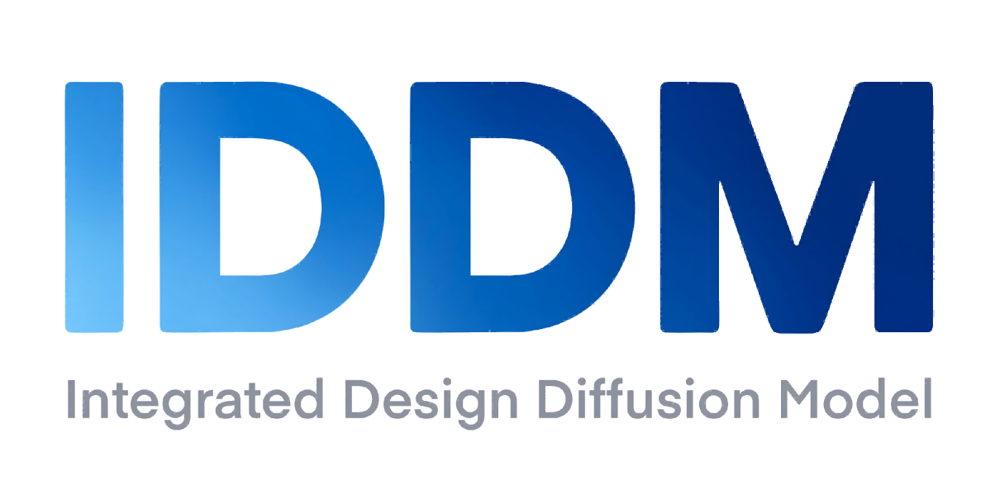

<div align="center">

<p>
  <a href="https://github.com/chairc/Integrated-Design-Diffusion-Model">
    
  </a>
</p>

# IDDM: Integrated Design Diffusion Model

English | [简体中文](README_zh.md)

[](https://github.com/chairc/Integrated-Design-Diffusion-Model)
[](https://doi.org/10.5281/zenodo.10866128)
[](https://deepwiki.com/chairc/Integrated-Design-Diffusion-Model)

[](./LICENSE)
[](https://github.com/chairc/Integrated-Design-Diffusion-Model/issues)
[](https://github.com/chairc/Integrated-Design-Diffusion-Model/releases)
[](https://img.shields.io/github/downloads/chairc/Integrated-Design-Diffusion-Model/total?color=3eb370)

[](https://github.com/chairc/Integrated-Design-Diffusion-Model/stargazers)
[](https://github.com/chairc/Integrated-Design-Diffusion-Model/forks)
[](https://gitee.com/chairc/Integrated-Design-Diffusion-Model)
[](https://gitee.com/chairc/Integrated-Design-Diffusion-Model)
[](https://gitcode.com/chairc/Integrated-Design-Diffusion-Model)

</div>


### About the Model

This diffusion model is based on the classic LDM (Latent Diffusion Models), DDPM (Denoising Diffusion Probabilistic Models), DDIM (Denoising Diffusion Implicit Models) and PLMS (Pseudo Numerical Methods for Diffusion Models on Manifolds) presented in the papers "[High-Resolution Image Synthesis with Latent Diffusion Models](https://openaccess.thecvf.com/content/CVPR2022/html/Rombach_High-Resolution_Image_Synthesis_With_Latent_Diffusion_Models_CVPR_2022_paper)", "[Denoising Diffusion Probabilistic Models](https://arxiv.org/abs/2006.11239)", "[Denoising Diffusion Implicit Models](https://arxiv.org/abs/2010.02502)" and "[Pseudo Numerical Methods for Diffusion Models on Manifolds](https://openreview.net/forum?id=PlKWVd2yBkY)".

We named this project IDDM: Integrated Design Diffusion Model. It aims to reproduce the model, write trainers and generators, and improve and optimize certain algorithms and network structures. This repository is **actively maintained**.

If you have any questions, please check [**the existing issues**](https://github.com/chairc/Integrated-Design-Diffusion-Model/issues/9) first. If the issue persists, feel free to open a new one for assistance, or you can contact me via email at chenyu1998424@gmail.com or chairc1998@163.com. **If you think my project is interesting, please give me a ⭐⭐⭐Star⭐⭐⭐ :)**

### Get Started

#### Running Locally

Use the `git clone` or directly download the `zip` file of this repository's code, and then configure the environment locally to run it.

```bash
git clone https://github.com/chairc/Integrated-Design-Diffusion-Model.git
cd Integrated-Design-Diffusion-Model
# Run the project in a virtual environment (recommended)
conda create -n iddm python=3.10
pip install -r requirements.txt
# Train the model
cd iddm/tools
python train.py --xxx xxx # Replace --xxx with your training parameters
# Generate images
python generate.py --xxx xxx # Replace --xxx with your generation parameters
```

#### Installation

In addition to running locally, there are also the following two approachs for installing this code.

**Approach 1**: Use [pip](https://pypi.org/project/iddm/) install (Recommend)

```bash
pip install iddm
```

The following  packages are required.

```yaml
coloredlogs==15.0.1
gradio==5.0.0
matplotlib==3.7.1
numpy==1.25.0
Pillow==10.3.0
Requests==2.32.0
scikit-image==0.22.0
torch_summary==1.4.5
tqdm==4.66.3
pytorch_fid==0.3.0
fastapi==0.115.6
tensorboardX==2.6.1

# If you want to use flash attention, please install flash-attn.
# Compile your own environment: pip install flash-attn --no-build-isolation
# or download flash-attn .whl file from github: https://github.com/Dao-AILab/flash-attention/releases/tag/v2.8.2
# Optional installation (Not installed by default)
flash-attn==2.8.2

# If you want to download gpu version
# Please use: pip install torch==1.13.0+cu116 torchvision==0.14.0+cu116 -f https://download.pytorch.org/whl/torch_stable.html
# About more torch information please click: https://pytorch.org/get-started/previous-versions/#linux-and-windows-25
# More versions please click: https://pytorch.org/get-started/previous-versions
# [Note] torch versions must >= 1.9.0
# More info: https://pytorch.org/get-started/locally/ (recommended)
torch>=1.9.0
torchvision>=0.10.0
```

**Approach 2**：Repository Installation

```bash
git clone https://github.com/chairc/Integrated-Design-Diffusion-Model.git
cd Integrated-Design-Diffusion-Model
pip install . # Or python setup.py install
```


### Next Steps

- [x] [2023-07-15] Adding implement multi-GPU distributed training.
- [x] [2023-07-31] Adding implement cosine learning rate optimization.
- [x] [2023-08-03] Adding DDIM Sampling Method.
- [x] [2023-08-28] Adding fast deployment and API on cloud servers.
- [x] [2023-09-16] Support other image generation.
- [x] [2023-11-09] Adding a more advanced U-Net network model.
- [x] [2023-11-09] Support generate larger-sized images.
- [x] [2023-12-06] Refactor the overall structure of the model.
- [x] [2024-01-23] Adding visual webui training interface.
- [x] [2024-02-18] Support low-resolution generated images for super-resolution enhancement.[~~Super resolution model, the effect is uncertain~~]
- [x] [2024-03-12] Adding PLMS Sampling Method.
- [x] [2024-05-06] Adding FID calculator to verify image quality.
- [x] [2024-06-11] Adding visual webui generate interface.
- [x] [2024-07-07] Support custom images length and width input.
- [x] [2024-11-13] Adding the deployment of image-generating Sockets and Web server.
- [x] [2024-11-26] Adding PSNR and SSIM calculators to verify super resolution image quality.
- [x] [2024-12-10] Adding pretrain model download.
- [x] [2024-12-25] Refactor the overall structure of the trainer.
- [x] [2025-03-08] Support PyPI install.
- [x] [2025-08-01] Adding LDM Method. **Support generate 512*512 images** and use Latent Diffusion and reduce GPU memory usage.
- [x] [2025-08-21] Support flash-attn, fast and GPU memory-efficient.
- [x] [2025-10-01] Adding the deployment of Docker file.
- [ ] [To be determined] Refactor the project by Baidu PaddlePaddle.


### Guide

Please read the guide carefully before developing or using.

|    Guide Name    |                   Document                   |
|:----------------:|:--------------------------------------------:|
|  Model Training  |   [Training.md](docs/en-US/02_training.md)   |
| Model Generation | [Generation.md](docs/en-US/03_generation.md) |
|  Model Results   |    [Results.md](docs/en-US/04_results.md)    |
| Model Evaluation | [Evaluation.md](docs/en-US/05_evaluation.md) |
|    Model List    | [Model List.md](docs/en-US/06_model_list.md) |


### Citation

If this project is used for experiments in an academic paper, where possible please cite our project appropriately and we appreciate this. The specific citation format can be found at **[this website](https://zenodo.org/records/10866128)**.

```
@software{chen_2024_10866128,
  author       = {Chen Yu},
  title        = {IDDM: Integrated Design Diffusion Model},
  month        = mar,
  year         = 2024,
  publisher    = {Zenodo},
  doi          = {10.5281/zenodo.10866128},
  url          = {https://doi.org/10.5281/zenodo.10866128}
}
```

**Citation detail**:

 


### Acknowledgements

[@dome272](https://github.com/dome272/Diffusion-Models-pytorch), [@donger](https://donger.me/) and [@JetBrains](https://www.jetbrains.com/)


### Sponsor


